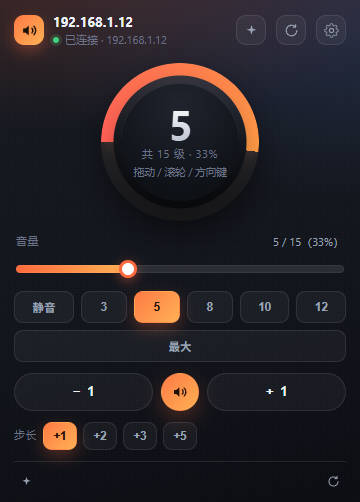
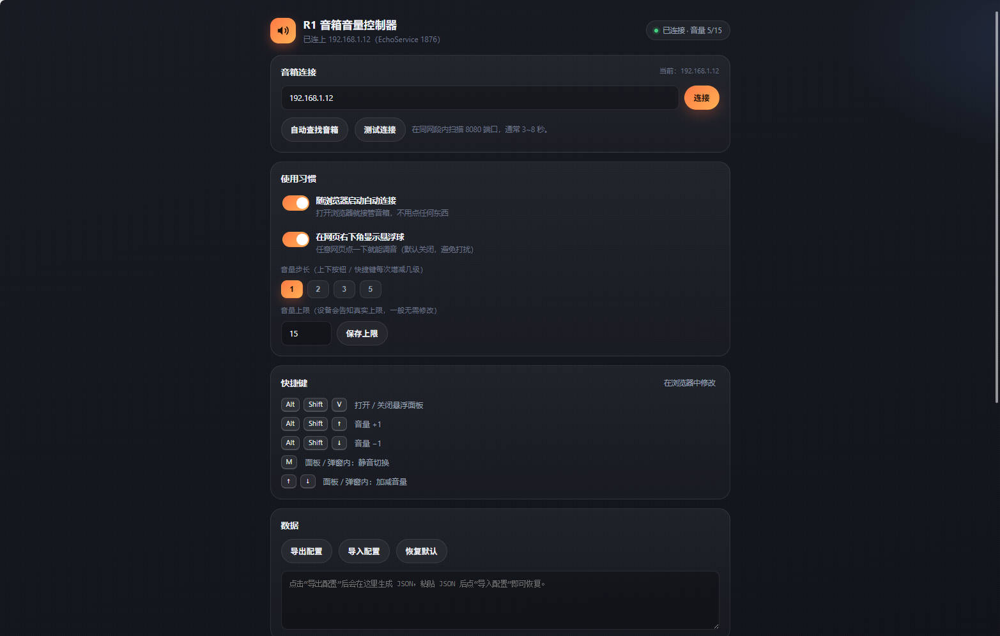

# R1 音箱音量控制器（浏览器扩展）

给 R1 音箱（EchoService）做的浏览器音量控制扩展：**打开浏览器就自动连上**，一个全局唯一的音量控制中枢，界面可直接拖动旋钮/滑杆调音，实时显示音量、静音、预设与设备信息。

> 非官方项目，与硬件厂商无关联。扩展通过音箱自带的 EchoService 局域网接口工作，
> 不需要登录、不需要联网账号，也不向任何互联网服务器发送数据。

**在线安装（30 秒）**：`chrome://extensions/` → 打开「开发者模式」→「加载已解压的扩展程序」→ 选择本仓库文件夹 → 在设置页填入音箱 IP。

协议完全对照 `r1-ctrl.js` 与官方控制页（`r1_control.min.js`）实现：

| 指令 | 说明 |
| --- | --- |
| `{"type":"get_info"}` | 读取设备状态，回复的 `data` 是 JSON 字符串 |
| `{"type":"max_vol"}` | 读取音量上限（`code:200`, `data:15`） |
| `{"type":"set_vol","vol":n}` | 设置音量（无回复，需再 `get_info` 回读） |
| `{"type":"send_message", what:4\|5, arg1:24\|25, arg2:1, obj:true}` | 播放 / 暂停 |
| `{"type":"reboot_echo"}` | 重启音箱上的 EchoService |

> **注意**：这套协议里**没有静音指令**，所以静音是靠写到设备能接受的最低档实现的，
> 具体做法见下方「静音是怎么实现的」。

---

## 界面预览

| 工具栏弹窗 | 设置页 |
| --- | --- |
|  |  |

---

## 一、安装（30 秒）

1. 打开 `chrome://extensions/`（Edge 是 `edge://extensions/`）
2. 右上角打开 **开发者模式**
3. 点 **加载已解压的扩展程序**，选择本仓库的根目录（含 `manifest.json` 的那一层）
4. 点浏览器工具栏里的扩展图标 → **去设置**，填入音箱 IP（例如 `192.168.1.12`），点 **连接**
   - 不知道 IP？点 **自动查找音箱**，会在同网段的 8080 端口上扫描并逐个握手验证
5. 完成。以后每次打开浏览器都会自动连上，图标角标实时显示当前音量

**前置条件**：音箱需已刷入 **EchoService** 并接入同一局域网（8080 端口可访问）。

> 需要 Chrome / Edge 116 或更高版本（用到 `chrome.offscreen` 与短周期 `chrome.alarms`）。
> 改完代码后在 `chrome://extensions` 点「重新加载」；**已打开的弹窗/设置页是独立页面，需要重新打开才会更新**。

## 二、功能

**调音量**
- 圆形旋钮：拖动调节、滚轮微调、方向键 ±1、**双击静音/恢复**、单击轻推一段
- 滑杆：拖动即时生效（约 110ms 节流）
- `−` / `✦图标` / `+` 三键一行：中间是静音开关，静音时按钮高亮
- 预设档位：静音 / 3 / 5 / 8 / 10 / 12 / 最大（按实际上限自动生成）
- 全局快捷键：`Alt+Shift+↑` / `Alt+Shift+↓` 调音量，静音键可自定义

**看状态**
- 大号数字显示当前音量，同时显示 `当前值 / 上限（百分比）`
- 图标角标显示实时音量（`!` 表示未连接，`…` 表示正在连接）
- 悬浮面板里能看到设备名、IP、EchoService 版本、正在播放的曲目与播放状态
- 弹窗底部保留「悬浮面板 / 刷新状态」两个入口

**静音是怎么实现的**
官方协议里**没有静音指令**，只有 `set_vol`，所以静音只能靠写到最低档实现：

1. 先 `set_vol 0`，然后回读真实音量（不信任写入）；
2. 回读是 0 → 静音成功，记住这个「静音档位」；
3. 回读不是 0（个别固件把 0 钳成 1）→ 隔 250ms 重试一次；
4. 仍然不是 0 → 把那一档记为设备的静音档位，判定为已静音并提示「已降到最低音量 N」；
5. 再点一次静音键，恢复到按下之前的音量。

界面判断是否静音用的是 `vol <= device.min`，所以即使用户手动把滑杆拖到最低档，按钮状态也是对的。

**面板与入口**
- 工具栏弹窗：完整控制面板
- 悬浮面板（`Alt+Shift+V` 或弹窗右上角 ✨）：独立小窗口，可拖动，带完整设备信息与「重启服务」

**健壮性**
- 断线自动重连（0.9s → 30s 指数退避），开机自启，`chrome.alarms` 每 30 秒保活
- 乐观更新 + 设备回读：拖动时界面立刻响应，随后以设备真实值为准
- 指令去重：一次拖动/一次按键只会下发一条 `set_vol`（浏览器会同时派发 `pointerup` 与 `change`）
- 方向键不会被重复处理：旋钮/滑杆自己消费按键并阻止冒泡
- 提示卡片严格按状态显示：连上了就不会再出现「去设置 / 重连」
- 设置页可测试单机连通性、扫描同网段、导出/导入配置

## 三、为什么是「全局唯一」

| 关注点 | 实现 |
| --- | --- |
| 唯一连接 | 连接只存在于 **唯一的屏幕外文档**（offscreen document）中；service worker 每次唤醒都会先 `chrome.runtime.getContexts` 检查，绝不会创建第二条连接 |
| 唯一指令队列 | 所有界面（弹窗/悬浮面板/快捷键）都只能通过 service worker 下发指令，执行时统一节流、统一回读，不会两个界面互相覆盖 |
| 唯一状态源 | 状态只由 offscreen 广播给 service worker，再 fan-out 给所有已打开的界面，界面之间永远同步 |
| 唯一悬浮面板 | 打开面板前会先查找已存在的面板窗口，存在则聚焦，不会开出第二个 |

## 四、目录结构

```
r1-volume-extension/
├─ manifest.json                 MV3 清单（快捷键、权限）
├─ icons/                        图标（由 tools/make-icons.js 生成）
├─ src/
│  ├─ background/service-worker.js  状态中枢：唯一连接、指令路由、角标、保活
│  ├─ offscreen/offscreen.{html,js} 屏幕外文档：唯一 WebSocket + 自动重连
│  ├─ common/
│  │  ├─ constants.js            协议常量、数据规范化、格式化（纯函数，可测）
│  │  ├─ connector.js            界面 ↔ service worker 通信封装
│  │  ├─ ui.js                   旋钮 / 滑杆 / 图标 / toast 组件
│  │  └─ ui.css                  共享视觉样式
│  ├─ popup/                     工具栏弹窗
│  ├─ panel/                     悬浮控制面板（独立窗口）
│  └─ options/                   设置页 + 同网段扫描器
└─ tools/
   ├─ check.js                   自检：语法、资源引用、manifest、重复 id、[hidden] 规则、HTML/JS id 核对
   ├─ harness.js                 测试脚手架：假 chrome.* API，能跑真实的 service worker + 屏幕外文档
   ├─ test-protocol.js           协议与状态逻辑单元测试（52 项）
   ├─ test-ui.js                 UI 组件回归测试（18 项：指令去重、方向键不重复生效）
   ├─ test-bridge.js             连接桥集成测试（26 项：假 WebSocket，含静音链路）
   ├─ test-worker.js             全链路测试（39 项：启动竞态、僵尸文档、自动重建、面板唯一性）
   ├─ test-faults.js             故障注入测试（39 项：连接桥装死、storage 缺失、旧版桥、诊断接口）
   ├─ live-test.js               真机联调（不需要装扩展）
   └─ make-icons.js              重新生成图标
```

## 五、开发与自检

```bash
cd r1-volume-extension
node tools/check.js           # 语法 + 资源引用 + manifest 自检
node tools/test-protocol.js   # 协议与状态逻辑单元测试
node tools/test-ui.js         # UI 组件回归测试（去重、键盘）
node tools/test-bridge.js     # 连接桥集成测试（静音链路、自动重连）
node tools/test-worker.js     # 全链路测试（启动竞态、僵尸文档、自动重建）
node tools/test-faults.js     # 故障注入测试（连接桥装死、storage 卡死）
node tools/live-test.js 192.168.1.12   # 真机验证（可选，直接跑扩展同款协议）
node tools/make-icons.js      # 重新生成图标
```

`tools/harness.js` 值得单独说明：它用假的 `chrome.*` API 把**真实的 service worker 和真实的屏幕外文档**
同时跑起来，用一个模拟消息总线让两者对话。像「扩展重载后遗留僵尸文档」这类问题，
只有在这种双上下文环境里才复现得出来；单独测某一个文件永远测不到。

改完代码后在 `chrome://extensions/` 点该扩展的 **重新加载** 即可生效；
**已经打开的弹窗/设置页是独立页面，需要重新打开才会更新**。

## 六、常见问题

**连接不上 / 角标一直是 `!`**
1. 确认音箱已开机，电脑和音箱在同一个局域网（同一 Wi-Fi / 同一路由器）
2. 在设置页点 **测试连接**，它会给出具体失败原因
3. 音箱 IP 变了（路由器重新分配）→ 点 **自动查找音箱** 重新扫描
4. 8080 端口被防火墙拦截 → 放行本机对 8080 的出站访问

**音量调了但界面又跳回去**
设备会把音量钳制到自己的上限（通常是 15）。界面会以设备回读值为准，这是正常的。

**快捷键没反应**
快捷键可能与其他扩展冲突，去 `chrome://extensions/shortcuts` 改绑（设置页有直达按钮）。

**控制台报 `Cannot read properties of undefined (reading 'onChanged')`**
这是**扩展重新加载**留下的历史报错，属于旧版本屏幕外文档的残留，不影响使用：

- 旧文档的扩展上下文已经失效（`chrome.storage`、`chrome.runtime` 变成 `undefined`）；
- 当前版本会检测到这一点并主动退出自己，让 service worker 重建一个干净的连接桥；
- 已经刷出来的旧日志不会消失（那是上一版实例留下的），点「重新加载」后新产生的日志里不会再有。

**弹窗显示「连接桥无响应」/「扩展后台没有响应」**
打开扩展的**设置页**，最下面有「后台诊断」：

1. 先点 **「重建连接桥」** —— 这是最有效的一步，会清掉所有缓存状态、重建屏幕外文档并重新连音箱；
2. 再点 **「刷新」** 看结果表：

| 现象 | 含义 |
| --- | --- |
| `后台应答：后台无应答` | service worker 没回应，点一次「重新加载」即可恢复 |
| `已应答请求` 不增长 | 同上 |
| `连接桥：不存在` | 屏幕外文档没建起来，看 `建桥进度` 与 `最后错误` |
| `连接桥自报` | **最重要的一行**：显示连接桥启动到哪一步；若为「从未自报」说明脚本根本没跑起来 |
| `Chrome 看到的文档数` | `1`=文档真实存在；`0`=被创建后立刻消失（脚本崩了/自己退出了） |
| `建桥进度` | 建桥卡在哪一步：创建文档 / 握手确认 / 回收旧桥 / 重置 |
| `WebSocket：建立 0 次` | 连接桥活着但没连上音箱，检查 IP 与网络 |
| `内部异常` 有内容 | 连接桥内部报错，那一行就是根因 |

> 「重建连接桥」的实现刻意不依赖任何缓存状态：清空 `wakePromise` / `offscreenPromise` 等所有
> 单例 Promise 与定时器，再要求连接桥做一次 nonce 握手确认。**只有握手过了才算可用**——
> 之前正是「`createDocument()` 成功就认为桥可用」，才会出现「桥已存在但从不工作」。
> 握手是在 5 秒内**反复重试**的：新建的文档需要时间加载脚本并注册消息监听器，
> 只发一次很容易落空而被误判成「创建后没有响应」。

**一个实测过的兼容性问题**

某些 Chrome 版本的**屏幕外文档里 `chrome.storage` 是 undefined**（而 `chrome.runtime` 正常，
manifest 也声明了 `storage` 权限）。所以连接桥的启动门槛只看 `chrome.runtime`：

- 早期版本把 `chrome.storage` 也当成必要条件 → 好端端的连接桥判自己「上下文失效」直接退出
  → 表现为「文档被创建后立刻消失（`Chrome 看到的文档数: 0`）、握手永远没人应答」；
- 现在 `storage` 缺失只是**降级**：设置改由 service worker 通过 `settings:get` 喂给它
  （这一步也带超时，任何环节都不会无限等待），其余功能完全不受影响。

**改了代码后请务必刷新已打开的界面**

扩展的弹窗/设置页是独立页面：在 `chrome://extensions` 点「重新加载」后，
**已经打开的旧页面不会自动更新**，会继续显示旧状态（比如明明已连接却显示「正在连接」）。
重新打开界面即可。这也是排查时容易误判的一点。

## 七、权限与隐私

扩展只与你填写的音箱地址通信（`ws://<IP>:8080`），不向任何互联网服务器发送数据，
不收集任何信息，也不向任何网页注入脚本。

**权限只有 4 个，都是功能必需的最小集合**：

| 权限 | 用途 | 不授予会怎样 |
| --- | --- | --- |
| `storage` | 保存音箱 IP、步长等设置 | 设置无法保存 |
| `alarms` | 定时保活、断线后重连 | 无法自动重连 |
| `offscreen` | 在屏幕外文档里长期维持 WebSocket 连接 | 连接会被 service worker 回收 |
| `system.network` | 「自动查找音箱」时获取本机网段 | 自动扫描不可用（仍可手填 IP） |

**没有 `host_permissions`，也没有 `tabs` 权限** —— 扩展不读取你浏览的任何网页。
唯一的网络行为是：

- 连接你填写的音箱地址（WebSocket，仅局域网）；
- 在你主动点「自动查找音箱」时，扫描当前网段的 8080 端口寻找设备（也仅局域网）。

## 八、参与贡献

欢迎提 Issue / PR。改代码前建议先跑一遍自检与测试：

```bash
node tools/check.js && node tools/test-protocol.js && node tools/test-ui.js \
  && node tools/test-bridge.js && node tools/test-worker.js && node tools/test-faults.js
```

约定：

- 保持**零运行时依赖**（`tools/` 只用 Node 标准库）；
- 涉及设备协议、连接生命周期、界面显隐的改动，**请同时补一条测试**——
  这个项目里绝大多数 bug 都属于「单文件测不出来、只有两个上下文对话时才暴露」的类型，
  所以 `tools/test-worker.js`（真实 service worker + 真实连接桥）和 `tools/test-faults.js`（故障注入）
  是主要防线；
- 提交前 `node tools/check.js` 必须通过（它检查语法、资源引用、manifest、重复 id、
  HTML/JS 的 id 双向核对、以及 `[hidden]` 规则是否真的能隐藏元素）。

## 九、致谢

- 控制协议的对照实现来自官方控制页 `r1_control.min.js` 与社区脚本 `r1-ctrl.js`；
- 图标由 `tools/make-icons.js`（零依赖手写 PNG 编码）生成。

## 十、许可

[MIT](LICENSE)

